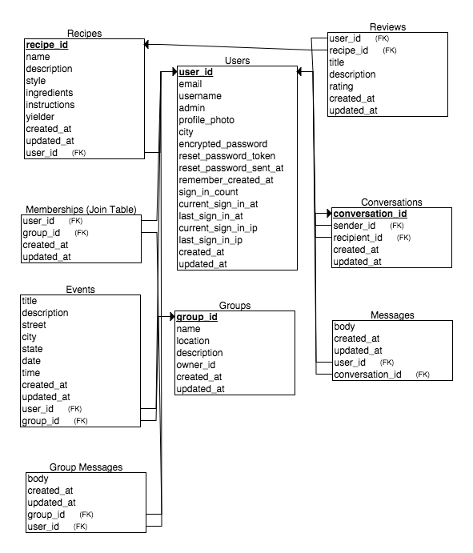

# BrewersBoard

## Description
A Rails app that allows users to submit beer recipes as well as connect with other users in the community through creating groups and events.

[Click Here To View Heroku Application](https://brewersboard.herokuapp.com/)

[Click Here To View Storyboard](https://trello.com/b/hTujWZ2k/brewers-board)

## ER Diagram

## Challenges Faced
* Setting up instant messaging system.
* Enhancing user interface with AJAX.
* Building a secure admin interface.
* Properly connecting the ten different tables in my database
* Employing Active Record callbacks to prevent modification and deletion of critical data.
* Using scopes to construct precise Active Record queries.
* Designing a visually attractive pages with SASS.
